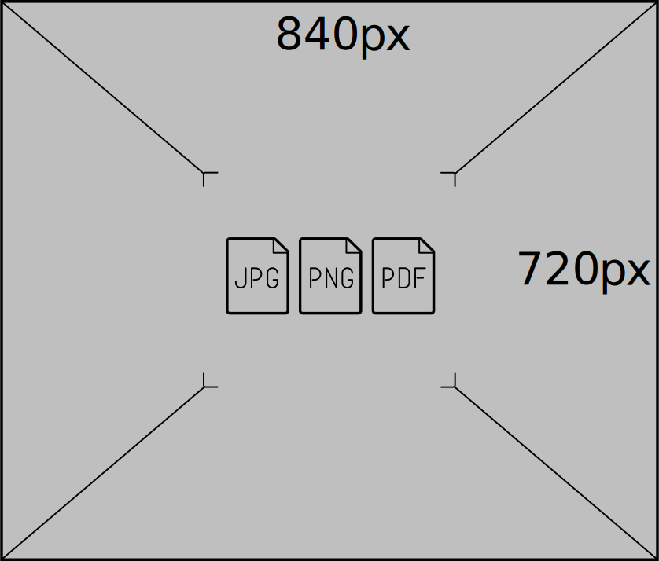

В этом репозитории находится шаблонная презентация в стиле Яндекса для движка [Shower](https://github.com/shower/shower). Контент презентации хранится в формате Markdown и преобразуется в слайды с помощью генератора разметки Jekyller, встроенного в GitHub. Cгенерированные слайды доступны для просмотра в GitHub Pages.

**[Пример презентации](https://github.yandex-team.ru/pages/presentation/jekyller/)**

### Оглавление

- [Как работать с презентациями в GitHub Pages](#Как-работать-с-презентациями-в-github-pages)
- [Как создать презентацию](#Как-создать-презентацию)
  - [Параметры презентации](#Параметры-презентации)  
  - [Слайды](#Слайды)
    - [Добавление слайдов](#Добавление-слайдов)
    - [CSS-классы](#css-классы)
    - [Изображения](#Изображения)
    - [Последовательное появление элементов слайда](#Последовательное-появление-элементов-слайда)
    - [Размеры и позиционирование элементов](#Размеры-и-позиционирование-элементов)
- [Как сохранить презентацию в PDF](#Как-сохранить-презентацию-в-pdf)
- [Как перенести презентацию на внешний GitHub](#Как-перенести-презентацию-на-внешний-github)
- [Библиотека материалов](#Библиотека-материалов)
- [Контакты](#Контакты)

## Как работать с презентациями в GitHub Pages

Вам нужно залогиниться под своим рабочим аккаунтом, создать форк этого репозитория и наполнить его своим контентом. Для этого вам потребуется изменить два файла: 
  - `_config.yml` — параметры презентации;
  - `index.md` — слайды.

Презентация генерируется при каждом изменении вашего форка. Cразу после создания форка презентация генерироваться не будет, поскольку к этому моменту еще нет ни одного изменения.

Просмотреть исправленную презентацию можно по адресу `github.yandex-team.ru/pages/<ваш-логин>/jekyller`. Она будет доступна через несколько минут после сохранения изменений. Для просмотра презентации авторизовываться на GitHub не нужно: ее смогут просмотреть все, у кого есть доступ к внутренней сети Яндекса. 

## Как создать презентацию

### Параметры презентации
Отредактируйте файл `_config.yml`. Здесь вы можете выбрать основные параметры презентации. Например: 
* название презентации; 
* имена докладчиков;
* соотношение сторон для слайдов — `default ratio` (доступны варианты `4x3`, `16x9`, `16x10`);
* язык для логотипа Яндекса — `presentation:lang` (русский или английский).

### Слайды
Для работы со слайдами выберите файл `index.md`. На основе этого файла и будут сгенерированы слайды. По умолчанию в файле находится контент-заглушка с оформлением слайдов разных типов, используйте его в качестве примера. Также обращайте внимание на пояснения в комментариях.

#### Добавление слайдов
Выберите в файле index.md место для нового слайда и вставьте заголовок второго уровня с помощью символов ##:

```md
## Название слайда
```
Текст заголовка будет отображаться как название слайда.

#### CSS-классы

Вы можете назначать элементам презентации произвольные CSS-классы. Для этого укажите название класса на следующей строке после элемента:

```md
<!-- картинка справа-->

{:.image-right}
```

Вы также можете указать несколько классов через пробел:

```md
## Название слайда
{:.images .two}
```

В шаблоне презентации уже определено несколько классов, которые можно использовать для оформления слайдов. Примеры использования всех классов можно найти в файле `index.md`.

Описать новые CSS-классы можно в специальном разделе файла `index.md`, в начале файла.

#### Изображения

Чтобы создать слайд с картинками, выберите один из примеров в файле `index.md`. Старайтесь, чтобы размеры изображений соответствовали размерам, указанным на изображениях-заглушках.

Если вам нужны схематические картинки в стиле Яндекса, используйте особый вид изображений — пиктограммы. Пиктограммы должны иметь фиксированный размер — 240x200 пикселей — и размещаться только на слайдах с классом `icons`. Сами пиктограммы можно выбрать в [Паттернах](https://patterns.yandex-team.ru/presentations?typeIn=icons) Яндекса. 

Большие фотографии и иллюстрации можно также найти в [Паттернах](https://patterns.yandex-team.ru) или выбрать на фотостоке [istockphoto.com](http://www.istockphoto.com/ru). Чтобы получить изображение из фотостока, пришлите нам ссылку, и мы купим его для вас.

#### Последовательное появление элементов слайда

Если вы хотите, чтобы элементы слайда (например, строки списка) появлялись по очереди, используйте CSS-класс `next`. Элементы с этим классом будут появляться в том же порядке, в котором они расположены в файле `index.md`. 

Пример разметки для последовательности картинок:

```md

{:.next}


{:.next}


{:.next}
```

Пример разметки для строк списка, которые появляются по очереди:

```md
1. {:.next}Строка списка.
2. {:.next}Строка списка.
3. {:.next}Строка списка.
```

#### Размеры и позиционирование элементов

Если необходимо задать размеры для элементов, указывайте значения в пикселях. При масштабировании слайдов элементы будут масштабироваться автоматически. Ширина слайда — 1920 пикселей. 

Если нужно разместить элемент в нестандартном месте (например, прижать к правому или нижнему краю слайда), используйте абсолютное позиционирование. 

По умолчанию стили для слайдов прописаны так, чтобы контент был выровнен по сетке с шагом 30 пикселей. При выборе размеров и положения элементов старайтесь, чтобы они тоже соответствовали сетке. Чтобы включить отображение сетки на слайде, добавьте для него CSS-класс `grid`:

```md
## Название слайда
{:.grid}
```

## Как сохранить презентацию в PDF

1. Откройте презентацию в любом браузере на основе Chromium.
2. Убедитесь, что на странице представлен список слайдов (не отдельный слайд).
3. Нажмите **Файл** ⟶ **Печать**. В качестве принтера выберите вариант **Сохранить как PDF**.

## Как перенести презентацию на внешний GitHub

Иногда презентацию нужно показывать с компьютера, не подключенного к внутренней сети Яндекса. Для этого вы можете создать ее копию на внешнем GitHub:

1. Создайте пустой репозиторий на [github.com](https://github.com).
2. Клонируйте репозиторий своей презентации с ключом `--bare`.
```
git clone https://github.yandex-team.ru/[owner]/[repo-name].git --bare
```
3. Добавьте в локальную копию репозитория ссылку на репозиторий, созданный в Шаге 1.
```
cd [repo-name].git
git remote add public https://github.com/[owner]/[repo-name].git
```
4. Выполните Push во внешний репозиторий с ключом `--mirror`.
```
git push public --mirror
```

## Библиотека материалов

Полная библиотека материалов для презентаций от Яндекса — с изображениями и примерами для оформления слайдов разных типов — находится на странице [patterns.yandex-team.ru/presentations](https://patterns.yandex-team.ru/presentations).

## Контакты

Если у вас возникли вопросы, напишите нам на рассылку [presentation@](presentation@yandex-team.ru). 

Если вы хотите, чтобы мы проверили вашу презентацию, отправьте ее на [prescheck@](prescheck@yandex-team.ru).
